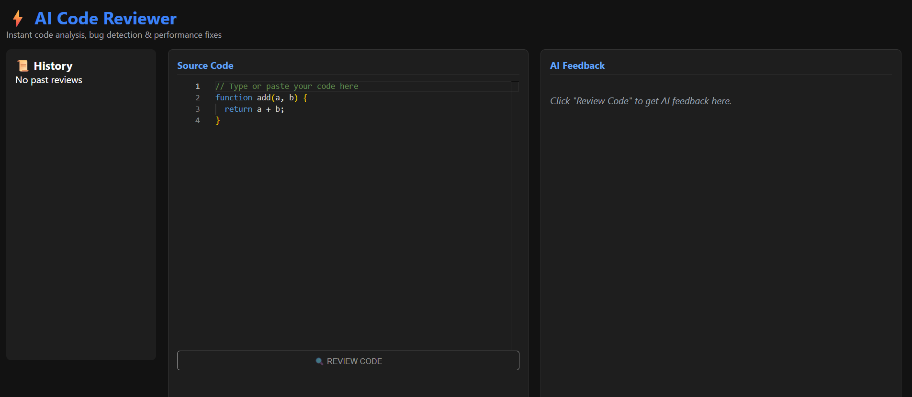

# AI Code Reviewer 🚀

An automated, full-stack AI-powered code review application built with the MERN stack and Google Gemini API. It analyzes code snippets for syntax errors, security vulnerabilities, performance bottlenecks, and provides optimized code refactoring in real-time.

---

## 📸 Application Screenshot & Demo



---

## ✨ Features

- **Automated Code Analysis:** Identifies bugs, logical flaws, and edge cases instantly.
- **Performance & Security Audit:** Detects memory leaks, unhandled exceptions, and potential security risks.
- **Code Refactoring:** Generates clean, optimized, and ready-to-use production code.
- **Resilient AI System:** Built-in model fallback strategy (`gemini-2.5-flash` to `gemini-2.0-flash`) ensuring zero downtime during peak usage.
- **Modern Responsive UI:** Built with React.js for clean developer experience.

---

## 🛠️ Tech Stack

- **Frontend:** React.js, Axios, CSS3 / Tailwind CSS
- **Backend:** Node.js, Express.js
- **Database:** MongoDB Atlas
- **AI Integration:** Google Gemini API (`@google/generative-ai`)
- **Deployment:** Vercel (Frontend), Render (Backend)

---

## ⚙️ Environment Variables

Create a `.env` file in the `backend` folder and add the following variables:

```env
PORT=5000
GEMINI_API_KEY=your_google_gemini_api_key_here
MONGO_URI=your_mongodb_connection_string
